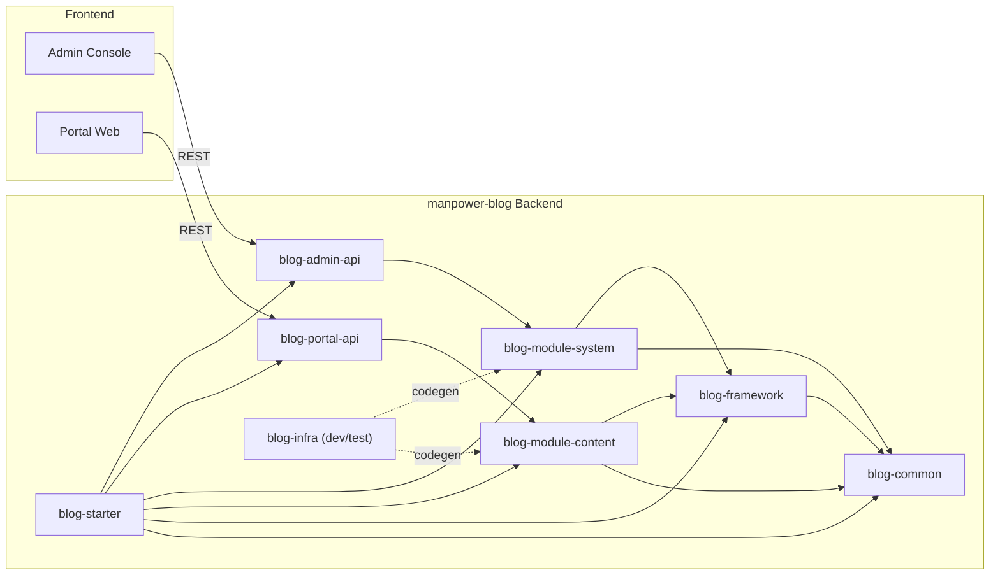
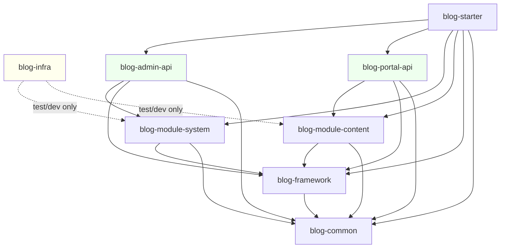

# manpower-blog アーキテクチャ設計書

## 0. 文書目的・適用範囲
本書は、`manpower-blog` の現行実装（Spring Boot 3 マルチモジュール構成）に対し、企業システム運用を前提とした基本設計レベルのアーキテクチャを整理するものである。記載内容は、リポジトリ上の `pom.xml`、各モジュール構成、実装済み package 構造、およびセキュリティ・例外処理コードを基準とする。

補足（English）: This document is based on the current codebase and Maven module graph, not assumptions.

## 1. システム全体アーキテクチャ概要

### 1.1 Backend / Frontend 分離構成
本プロジェクトはバックエンド API 群を単独リポジトリで管理し、フロントエンドは別プロジェクトとして連携する分離構成を採用している。バックエンド側は `blog-starter` を実行起点として、管理系 API と公開系 API を同一プロセス上に統合デプロイできる。

- Backend: Spring Boot 3.4.9 + Spring Security + MyBatis-Plus + JWT
- Frontend: 別プロジェクト（管理コンソールおよび公開ポータル）

### 1.2 Admin API と Portal API の役割分離
役割分離はモジュール境界で明確化されている。

- **Admin API（`blog-admin-api`）**
  - 主対象: 認証、ユーザー・ロール・権限等のシステム管理
  - 代表エンドポイント: `/api/system/auth/**`, `/api/system/role/**`
  - RBAC に基づく制御を前提
- **Portal API（`blog-portal-api`）**
  - 主対象: 記事（content）提供・更新
  - 代表エンドポイント: `/api/articles/**`, `/api/portal/ping`
  - 公開系用途を想定しつつ、将来的な権限制御追加に対応可能

## 2. レイヤードアーキテクチャ設計

本システムはモジュール境界を伴うレイヤード構成である。責務を「入出力」「業務」「ドメインデータ」「横断基盤」に分割し、変更影響範囲を局所化する。

### 2.1 Controller レイヤ
- 配置先: `blog-admin-api`, `blog-portal-api`
- 役割:
  - HTTP リクエスト受理
  - DTO バリデーション（`@Valid`）
  - Service 呼出
  - `Result<T>` 形式でのレスポンス返却
- 特徴:
  - 認可は `@PreAuthorize` と SecurityFilterChain を併用
  - 認証主体は `SecurityContext` から取得

### 2.2 Service レイヤ
- 配置先: `blog-module-system`, `blog-module-content`
- 役割:
  - 業務ロジック実装
  - DTO/Entity の変換
  - Mapper 連携
  - 例外（`BizException`）の業務的投げ分け
- 特徴:
  - `system` 側で RBAC の中核ロジック（User/Role/Permission）を保持
  - `content` 側で記事ライフサイクル処理を保持

### 2.3 Domain / Module レイヤ
- 配置先: `blog-module-system`, `blog-module-content`
- 主要構成:
  - Entity
  - Mapper / XML
  - DTO / VO
  - Domain Service
- 設計意図:
  - 業務ドメイン単位で独立性を確保し、将来的な分散化時にモジュール単位の切出しを可能化

### 2.4 Framework / Common レイヤ
- **blog-common**: DTO、列挙、共通例外、ユーティリティ
- **blog-framework**: Security、JWT、GlobalExceptionHandler、MyBatis 設定、I18n、Swagger、TraceId、Redis
- 設計意図:
  - 横断機能の再利用性向上
  - API 契約（`Result<T>`）と運用性（traceId、i18n）を全モジュールで統一

## 3. モジュール依存関係設計

### 3.1 各モジュールの責務
1. `blog-common`
   - 共通 DTO（`Result`, `LoginRequest` 等）
   - 共通例外（`BizException`）
   - 共通列挙（`ErrorCode` 等）
2. `blog-framework`
   - セキュリティ構成（SecurityFilterChain, JWT Filter/Provider）
   - グローバル例外ハンドラ
   - MyBatis-Plus 設定
   - Redis / Swagger / I18n / TraceId
3. `blog-infra`
   - コード生成（MyBatis-Plus Generator）等の開発支援（test scope）
4. `blog-module-system`
   - ユーザー、ロール、権限、ログイン
   - RBAC 権限データの提供
5. `blog-module-content`
   - 記事ドメイン（Article）
6. `blog-admin-api`
   - 管理系 API エンドポイント
7. `blog-portal-api`
   - 公開系 API エンドポイント
8. `blog-starter`
   - アプリケーション起動集約モジュール

### 3.2 依存方向（実装準拠）
- `blog-framework` → `blog-common`
- `blog-module-system` → `blog-framework`, `blog-common`
- `blog-module-content` → `blog-framework`, `blog-common`
- `blog-admin-api` → `blog-module-system`, `blog-framework`, `blog-common`
- `blog-portal-api` → `blog-module-content`, `blog-framework`, `blog-common`
- `blog-starter` → `blog-admin-api`, `blog-portal-api`, `blog-module-system`, `blog-module-content`, `blog-framework`, `blog-common`
- `blog-infra` は実行系への必須依存ではなく、開発支援用途

## 4. 認証・認可アーキテクチャ

### 4.1 Spring Security
- `SecurityConfig` にて Stateless セッション（JWT 前提）を採用
- `/api/system/auth/login` は匿名許可
- `/api/system/auth/**` と `/api/system/**` は認証必須
- メソッドレベル認可（`@EnableMethodSecurity`）を有効化

### 4.2 JWT
- ログイン成功時に `JwtTokenProvider` がトークンを生成
- `JwtAuthenticationFilter` が `Authorization: Bearer <token>` を検証
- 検証後、`SecurityContext` に `LoginPrincipal` と authority を設定

### 4.3 RBAC 設計思想
- ドメインモデル:
  - `User` / `Role` / `Permission`
  - 関連テーブル: `UserRole`, `RolePermission`
- 権限ロード:
  - `UserAuthorityProvider`（framework IF）を `SystemUserAuthorityProvider`（system 実装）で具象化
  - ユーザーに紐づく permission code を動的ロード
- 認可実行:
  - URL 認証（authenticated）
  - 必要箇所で `@PreAuthorize("hasAuthority('...')")`

補足（中文）: RBAC 的关键点是将权限码（permission code）与 Spring Security `GrantedAuthority` 对齐，避免硬编码角色判断。

## 5. API 設計方針

### 5.1 `Result<T>` 統一レスポンス
全 API は原則 `Result<T>` を返却し、以下の標準項目を統一する。

- `code`: 業務/HTTP 相当コード
- `message`: 表示メッセージ（i18n キー解決後）
- `data`: ペイロード
- `traceId`: トレーサビリティ
- `timestamp`: サーバ時刻
- `detail`: 非本番向け詳細情報

本方針により、フロントエンド実装はステータス判定・エラーハンドリングを共通化できる。

### 5.2 例外ハンドリング戦略
- `@RestControllerAdvice`（`GlobalExceptionHandler`）で一元処理
- `BizException` は業務コードと messageKey を維持したまま応答
- Validation 系、HTTP 仕様違反、AccessDenied、Unexpected Exception を分類処理
- 本番環境では `detail` の秘匿を想定（`safeDetail`）

## 6. セキュリティ設計概要

### 6.1 認証フロー
1. クライアントが `/api/system/auth/login` へ資格情報送信
2. `LoginService` が認証
3. `JwtTokenProvider` が JWT 発行
4. クライアントは Bearer Token を付与して再アクセス
5. `JwtAuthenticationFilter` がトークン検証し、認証コンテキストを確立

### 6.2 権限チェック
- レイヤ 1: URL パターン単位での認証必須化
- レイヤ 2: `@PreAuthorize` による業務機能単位権限制御
- レイヤ 3: RBAC データ（DB）を基盤とする authority 判定

設計意図は「認証不備の早期遮断」と「機能粒度での最小権限制御」の両立である。

## 7. 将来拡張性

### 7.1 Redis 活用
現時点で Redis 設定クラスおよびヘルスチェック実装が存在するため、以下への段階的拡張が容易である。

- 認証補助（トークン失効管理、ブラックリスト）
- キャッシュ（参照系 API の応答短縮）
- レート制御

### 7.2 MQ 活用
現行モジュール分割（API / Domain / Framework）を維持したまま、非同期イベント連携を追加可能。

- 記事公開通知
- 監査ログ非同期転送
- バッチ連携

### 7.3 分散化・マイクロサービス化への適合性
- ドメインモジュール（system/content）が独立しており、サービス境界候補が明確
- `blog-common` 契約を API DTO 共通仕様として活用可能
- 将来的には以下を段階適用する。
  - API Gateway
  - 認証サービス分離
  - ドメインサービス分割
  - 分散トレーシング導入

補足（English）: Current modular boundaries are suitable for progressive decomposition into microservices.

## 8. Mermaid 図

### 8.1 システム構成図

### 8.2 モジュール依存図（Maven）

## 9. 実装整合性に関する注記
- ルート POM の `java.version` は 21 である。したがって実行基盤は Java 21 を前提とする。
- 一方、設計思想としては「JDK17 以降 LTS 世代に準拠したコーディングスタイル」を継承しており、Java 21 はその上位互換として位置付ける。
